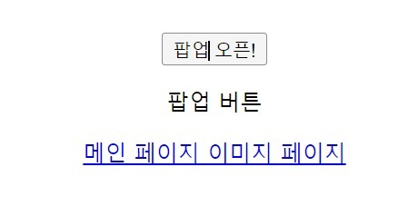

# 앵커 링크

- [헤더적기](#헤더적기)
- [코드블럭](#코드블럭)
- [네이버](https://www.naver.com)


# 헤더1
## 헤더2
### 헤더3
#### 헤더4
헤더가 아닌 글씨

---


# ordered 리스트
1. 엔터를 눌러보세요
2. 탭을눌러보세요
   1. 탭을 누르면 2-1번
3. 3번

# unordered 리스트
* -기호 또는 +기호 또는 *기호 상관없습니다
* 엔터
* 대시

# 체크 리스트 만들기

- [x] 당근
- [x] 양파
- [x] 마늘


# 코드 블럭(백틱 3번) --> 왜 많이 쓸까?
프로그래밍 언어마다 다른 가독성으로 표시해 준다.

```python
def func(a, b):
    return a + b


a, b = int(input())
c = func(a, b)
print(c)
```

# 링크 url 걸기
[네이버](https://www.naver.com)

# 이미기 걸기



# 글꼴 굵게 표시

__굵은 글씨__

중간에 **굵은 글씨**를 넣기

# 기울기

_기울기 글씨_

중간에 *기울기 글씨*를 넣기

# 굵게 및 기울임

___굵게 및 기울임___

중간에 ***굵게 및 기울임***을 넣기


# 취소선
~~박보검~~

# 수평선
---
####
